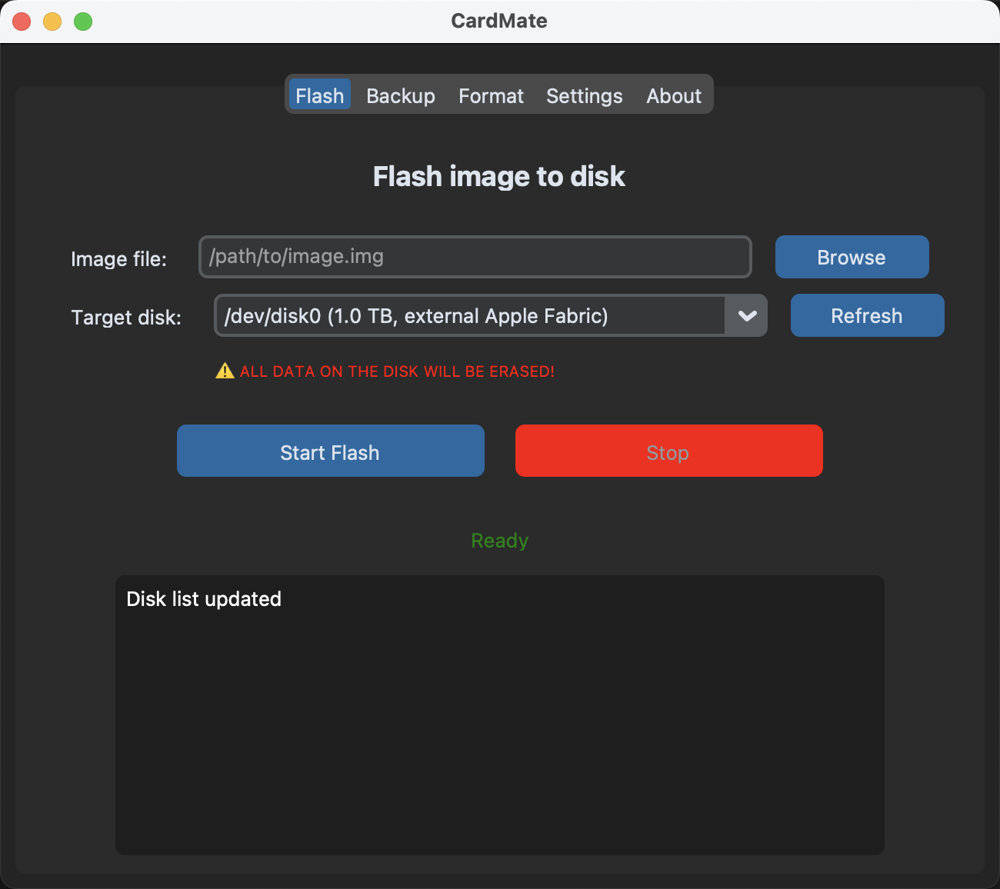

# CardMate
A cross-platform GUI application that will help you work with flashing and backup sd cards

# UI:
[]

# Build:

## Linux

```
pyinstaller --name="CardMate" --onefile --windowed --icon=icons/icon.png main.py
```

## Mac OS

```
pyinstaller --name="CardMate" --onefile --windowed --icon=icons/icon.icns main.py
```

## Windows:

```
pyinstaller --name="CardMate" --onefile --windowed --icon=icons/icon.ico main.py
```

# Run:

```
source venv/bin/activate
python3 main.py
```